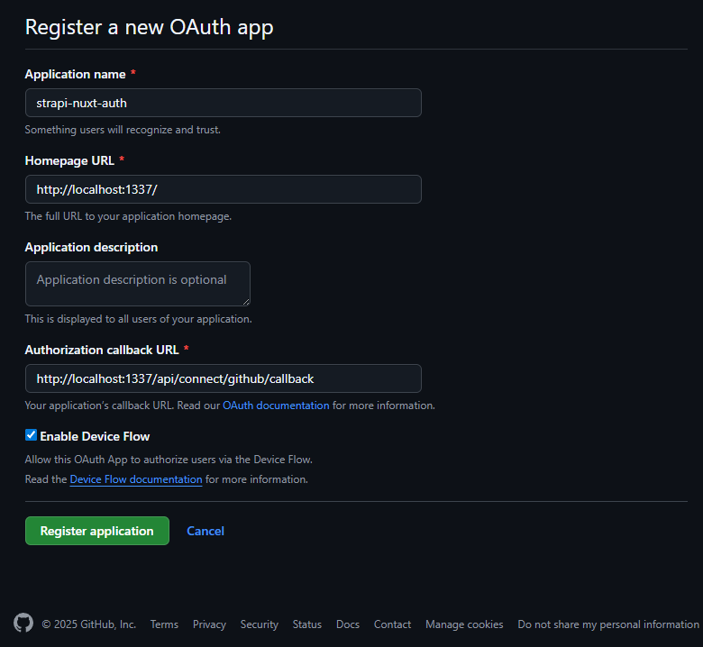
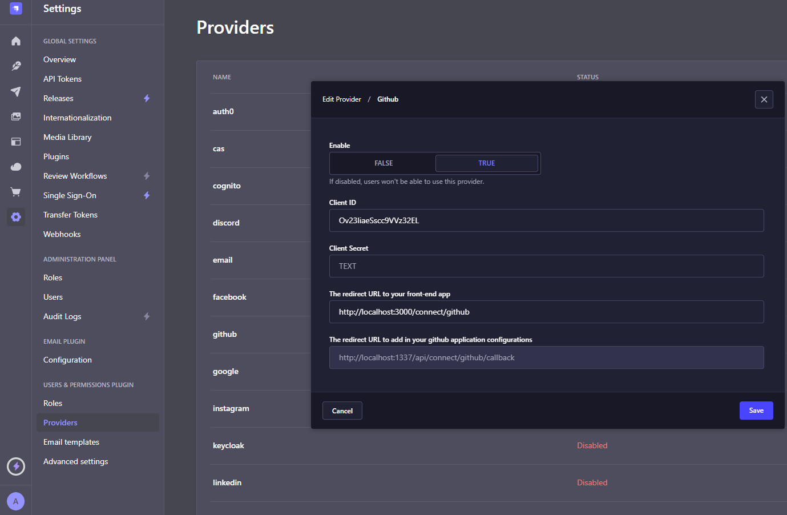
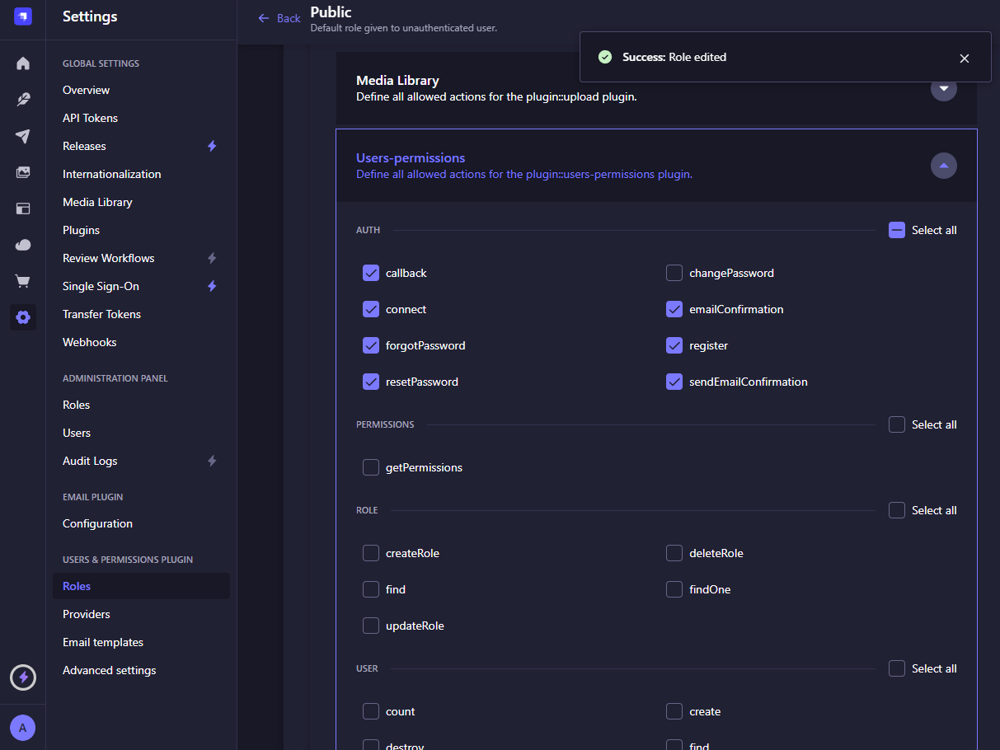
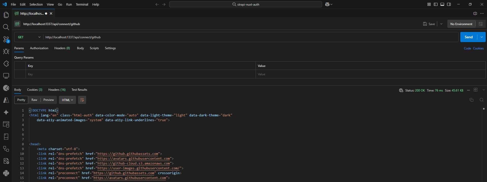

# 🚀 Backend (Strapi) - Implementation Guide


Strapi comes with a full featured [Command Line Interface](https://docs.strapi.io/dev-docs/cli) (CLI) which lets you scaffold and manage your project in seconds.

## Table of Contents

- [Installation & Setup](#installation--setup)
- [Social Providers Setup](#social-providers-setup)
- [Creating the OAuth App in GitHub](#creating-the-oauth-app-in-github)
- [Permissions & Roles](#permissions--roles)
- [API Testing](#api-testing)

---

## Installation & Setup

1. Create a Strapi project by running the following command in your terminal:

   ```bash
   npx create-strapi-app@latest backend
   ```

   Answer “yes” to all questions.

2. You should now have a new Strapi app with a default SQLite database. To start it in development mode, open your project and run:
   ```bash
   cd backend
   npm run develop
   ```
3. Once the project is running, Strapi will automatically open in your browser at [http://localhost:1337/admin](http://localhost:1337/admin). Create the admin user to access the Strapi admin panel.

---

## Social Providers Setup

1. Go to **Settings > Providers** in the Strapi admin panel under the Users & Permissions plugin section.
2. Enable the **GitHub** provider by clicking the pencil icon on the right and copy the redirect URL.

```bash
http://localhost:1337/api/connect/github/callback
```

---

## Creating the OAuth App in GitHub

1. Go to [GitHub Developer Settings](https://github.com/settings/developers).
2. Click "New OAuth App" and fill in the fields:

   - **Application Name**: Choose a descriptive name.
   - **Homepage URL**: `http://localhost:3000`
   - **Authorization callback URL**: Use the redirect URL provided by Strapi:
     ```
     http://localhost:1337/api/connect/github/callback
     ```
   - You can refer to the following image:

   

3. After creating the app, copy the **Client ID** and **Client Secret** and paste them into the GitHub provider settings in Strapi.
   

---

## Permissions & Roles

1. Go to **Settings > Roles**.
2. Edit the **Public** role and enable connection and callback permissions.
   

---

## API Testing

1. Make a GET request to:
   ```
   http://localhost:1337/api/connect/github/
   ```
   
2. Verify the OAuth flow and user creation.

---

Start your Strapi application with autoReload enabled. [Learn more](https://docs.strapi.io/dev-docs/cli#strapi-develop)

```
npm run develop
# or
yarn develop
```

### `start`

Start your Strapi application with autoReload disabled. [Learn more](https://docs.strapi.io/dev-docs/cli#strapi-start)

```
npm run start
# or
yarn start
```

### `build`

Build your admin panel. [Learn more](https://docs.strapi.io/dev-docs/cli#strapi-build)

```
npm run build
# or
yarn build
```

## ⚙️ Deployment

Strapi gives you many possible deployment options for your project including [Strapi Cloud](https://cloud.strapi.io). Browse the [deployment section of the documentation](https://docs.strapi.io/dev-docs/deployment) to find the best solution for your use case.

```
yarn strapi deploy
```

## 📚 Learn more

- [Resource center](https://strapi.io/resource-center) - Strapi resource center.
- [Strapi documentation](https://docs.strapi.io) - Official Strapi documentation.
- [Strapi tutorials](https://strapi.io/tutorials) - List of tutorials made by the core team and the community.
- [Strapi blog](https://strapi.io/blog) - Official Strapi blog containing articles made by the Strapi team and the community.
- [Changelog](https://strapi.io/changelog) - Find out about the Strapi product updates, new features and general improvements.

Feel free to check out the [Strapi GitHub repository](https://github.com/strapi/strapi). Your feedback and contributions are welcome!

## ✨ Community

- [Discord](https://discord.strapi.io) - Come chat with the Strapi community including the core team.
- [Forum](https://forum.strapi.io/) - Place to discuss, ask questions and find answers, show your Strapi project and get feedback or just talk with other Community members.
- [Awesome Strapi](https://github.com/strapi/awesome-strapi) - A curated list of awesome things related to Strapi.

---

<sub>🤫 Psst! [Strapi is hiring](https://strapi.io/careers).</sub>
